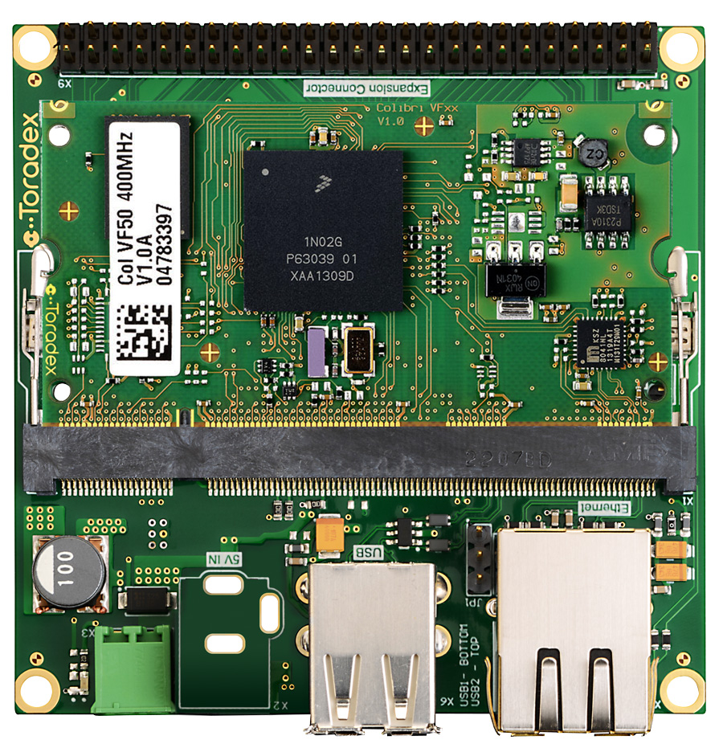
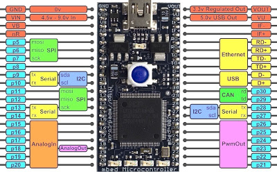

# ATTA
Projeto final da matéria **SEM0544 - Sistemas Embarcados (2022)**

## Alunos
* [Leandro Yuji Kanno](https://github.com/L-Yuji) (NºUSP 10883811)
* [Vinícius Motta Benatti](https://github.com/benattiv) (NºUSP 10820762)

## Introdução

## Proposta
O projeto possui o objetivo de implementar o movimento de caminhada de um robô hexapode. O hardware utilizado é composto por 12 servo motores de aeromodelismo, sendo 2 para cada perna, uma placa Toradex VF50, responsável por controlar todo o sistema, e duas MBEDS, que funcionarão como sistemas escravos controlando os servos. Infelizmente, como ambos os membros do grupo estão fazendo estágio fora de São Carlos, não foi possível realizar testes práticos com os códigos desenvolvidos utilizando o hardware disponibilizado.

## Desenvolvimento
A primeira etapa do desenvolvimento foi projetar a lógica do funcionamento do sistema, para depois programar o movimento do robô e a comunicação entre as placas. 

Como a Toradex não apresenta saídas de PWM suficientes para todos os motores, decidimos utilizar 2 MBEDS como placas auxiliares (sistemas escravos) para controlar os motores, deixando uma delas com as pernas pares e a outra com as ímpares como mostrado na figura abaixo.

<table>
  <tr>
    <td></td>
    <td></td>
  </tr>
    <tr>
    <td>Toradex VF50 </td>
     <td>MBED</td>
  </tr>
 </table>

Após a definição do hardware, dividimos o projeto em duas partes, uma para desenvolver o código da movimentação e outra para desenvolver o código para a comunicação entres as três placas por meio do protocolo CAN.

### Movimentação
Durante o desenvolvimento da lógica da caminhada nos deparamos com diferentes tipos de movimentos possíveis. Visando tornar o código mais leve, decidimos programar o movimento de forma que as pernas pares e ímpares possuam movimentos separados. Esse tipo de caminhada também gera uma maior estabilidade, pois sempre haverão no mínimo 3 pernas em contato com o solo. Para auxilixar o desenvolvimento do código, produzimos o fluxograma abaixo.

A partir disso começamos a desenvolver o código [Formiga.c](Formiga.c), que é responsável por todo o controle do movimento das pernas. Ele realiza o controle dos motores por meio de uma lógica incremental das variáveis que, ao chegarem ao valor final, serão enviadas para as MBEDs via protocolo CAN. Para facilitar a implementação do movimento, ele foi dividido em 4 estapas, sendo elas:
* 1 - Elevação da perna;
* 2 - Translação (frente ou trás);
* 3 - Abaixamento da perna;
* 4 - Retornar a posição inicial.

Além disso, também realizamos o desenvolvimento do código [mbed.c](mbed.c) que irá rodar nas MBEDs, sendo responsável pelo recebimento das variáveis, normalização e envio para os motores por meio da biblioteca Servo.h. Para reduzir a quantidade de envios nescessários para a movimentação, a toradex envia o valor final dos servos e a MBED é responsável por realizar o incremento nos motores até atingir o valor normalizado. Os códigos para ambas as MBEDs são iguais, mudando apenas os motores 1, 3 e 5 para 2, 4 e 6.

### Protocolo CAN

## Conclusão

